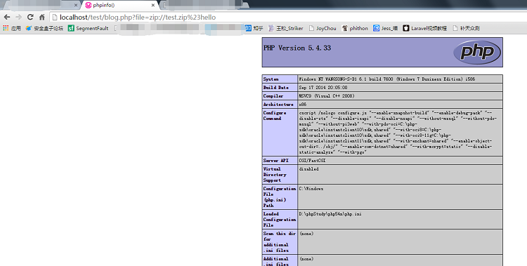

## 适用情况
可以控制协议的情况下，如果`%00`无法截断包含，可使用这招
```PHP
<?php
$a = $_GET['file'];
inlcude $a.'.html.php';
>
```

## 思路&方法
思路主要是利用了PHP的一个流封装的特点，可以参考PHP官方文档中的Example #3
假设存在文件包含的代码为:
```PHP
<?php
$a = $_GET['file'];
include $a.'.html.php';
```
但是我们`%00`无法截断，只能包含xxx.html.php

首先我们新建一个`hello.html.php`，内容为`phpinfo();`然后压缩成zip，结构如下图:


然后访问如下网址，成功包含压缩文件内的`hello.html.php`。如图：



把我们输入的变量和`include`后面的变量和起来就是`zip://test.zip#hello.html.php`,代表当前目录下的test.zip压缩包里面的hello.html.zip，于是包含成功。

## 总结
代码审计要走的路还很长~我还要继续学习。很早以前和柠檬草(l3mon)叔叔搞站遇到过这种情况，当时无果放弃了，前几天草叔告诉我他有思路了。感谢柠檬草叔叔给我分享这个技巧，让我学到了新只是。谢谢你:)

## 我的话
本文虽然写出了原理，但是还是有些不完善的地方。zip文件很多时候是无法直接上传的，所以我们可以将zip文件修改为`.jpg`的文件进行上传(当然也不一定能够保证上传成功)。其次，除了`zip`协议可以用之外，还可以使用`phar`协议。
