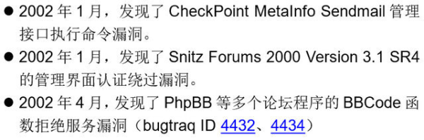

很多人以为我是专门研究二进制安全的，所以偏向二进制方向。其实去年发现的BadTunnel就不属于二进制方向：《[BadTunnel：跨网段劫持广播协议](https://mp.weixin.qq.com/s?__biz=MzA5NDYyNDI0MA==&mid=2651953600&idx=1&sn=7779613d4886c7739a9bbf076b7195f9)》。你上面提到的东西，我基本都搞过。

这是很早以前一份简历里的内容：

就在前几年也还研究过Web前端相关的问题：《[浏览器和本地域](http://hitcon.org/2013/download/%5BI1%5D%20Tombkeeper%20-%20%E7%80%8F%E8%A6%BD%E5%99%A8%E5%92%8C%E6%9C%AC%E5%9C%B0%E5%9F%9F_HITCon2013.pdf)》

你说的无线攻击我也研究过：《[来自空中的威胁](http://www.cert.org.cn/upload/cncertcc06/0330/ct1/5.060330-YuYang-ThreatsFromAir.pdf)》

渗透测试做的就更多了。以前在乙方公司，我是渗透测试的主力。还记得最忙一个项目，我和部门领导一起，两个月做了184台服务器的渗透测试。
所以我可能是最不会对各类安全技术有偏见的人。

无论哪类技术，背后的需要的东西都是类似的。AFL这个革命性的二进制漏洞Fuzz工具的作者，也是《The Tangled Web: A Guide to Securing Modern Web Applications》这本Web安全圣经的作者。

我们施压是有几个做Windows方向的同学，毕业前都没有接触过Windows安全。单在实验室工作半年后，就开始能做一些成果。一年之后，就已经能做出不错的东西。当然，
这部意味着干这行容易，人人可为。这几位同学虽然之前没接触过Windows安全，但在校期间，在其他方向上都做出一些东西。我记得其中一个同学，毕业前啃了几个月Apache源码，发现一个漏洞。在Apache李还能搞出东西来，是不容易的。

工作并不意味这学习的结束，而是另一个开始。我们大多数人至少都要工作三十年，这三十年里还会有很多东西要学。所以不用在意之前学什么，更重要的是看你还能学会什么。无论之前学过什么，将来都要再学新东西。无论之前学的是什么，将来也都会有用。艺无止境，功不唐捐。