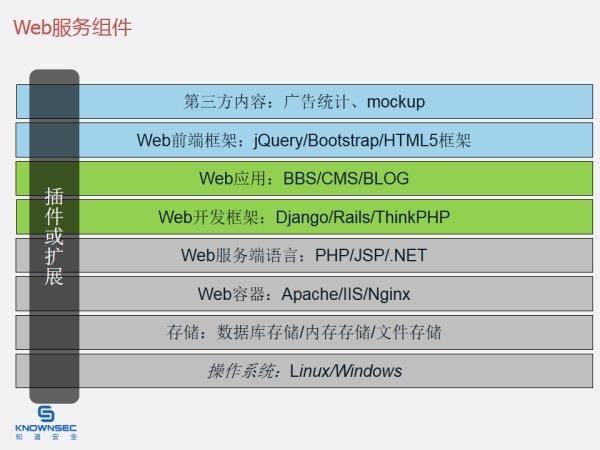

这是一个好问题，我强迫症犯了，本来你写的是“web”，我改成了“Web”。

因为正好Web安全是我擅长的，你的是**0基础**，我总结一下我的一些看法吧，针对0基础的。

### 一. 首先你得了解Web
Web分为好几层，一图胜千言



事实是这样的：**如果你不了解这些研究对象是不可能搞好安全研究的。**

这样看来，Web有八层（如果把浏览器也算进去，就九层啦，九阳神功……）!!! 每层都有几十种主流组件!!! 该怎们办？

别急，**一法通则万法通**，这是横向的层，纵向的就是**数据流**啦！搞定好数据流：从横向的层，从上到下->从下到上，认真看看浙西数据在每个层是怎么个处理的。

数据流中，有个关键的是HTTP协议，从上到下->从下到上的头尾两端(即请求和响应)，搞通！难吗？《HTTP权威指南》720页！！！ 坑爹，好难！！！

怎么办？

横向那么复杂、纵向数据流的HTTP协议就720页的书！！！放弃好了……

不，千万别这样。

**给你点信心是：**《HTTP权威指南》这本书我压根就没有看过。但是通过百度/Google一些入门的HTTP协议，我做了大概的了解，然后Chrome浏览器F12实际看看“Network”标签里的HTTP请求和响应，不出几小时，就大概知道HTTP协议这玩意了。（这就是快速研究的精髓啊）

搞明白HTTP协议后，你就会明白安全术语的“**输入输出**”。

黑客通过**输入**提交“特殊数据”，特殊数据在**数据流**的每个层处理，如果某个层没处理好，在**输出**的时候，就会出现相应层的安全问题。

**精彩举例：**
>1. 如果在操作系统层上没处理好，比如Linux和Bash环境把“特殊数据”当作**指令**执行时，就产生了**OS命令执行**的安全问题，这段“特殊数据”可能长得如下这般：
```
;rm -rf /;
```
2. 如果在存储层的数据库中没处理，数据库的SQL解析引擎把这个“特殊数据”当作**指令**执行时，就产生**SQL注入**这样的安全问题，这段“特殊数据”可能长得如下这般：
```SQL
' union select user,pwd 1,2,3,4 from users--
```
3. 如果在Web容器如nginx中没处理好，nginx把“特殊数据”当作**指令**执行时，可能会产生远程溢出、Dos等各种安全问题，这段“特殊数据”可能长得如下这般：
```
%c0.%c0./%c0.%c0./%c0.%c0./%c0.%c0./%20
```
4. 如果在Web开发框架或Web应用层中没处理好，把“特殊数据”当作**指令**执行时，可能会产生远程命令执行的安全问题，这段“特殊数据”可能长得如下这般:
```PHP
eval($_REQUEST['x']);
```
5. 如果在Web前端层中没有处理好，浏览器的JS引擎把“特殊数据”当作**指令**执行时，可能会产生XSS跨站脚本的安全问题，这段“特殊数据”可能长得如下这般：
```JS
'"><script>alert(/cos is my hero./)</script>
```
怎样，刺激吧？搞懂这些。就算入门啦。
- **记好：一切的安全问题都体现在“输入输出”上，一切的安全问题都存在于“数据流”的整个过程中。**
- **记好：“数据流”、“输入输出”这两个关键点。**

你好像悟到了点什么，咱么继续……

前面说了：**如果你不了解这些研究对象是不可能搞好安全研究的。**

那我XSS来说，曾经有人问我，我回答的一个：在学习XSS前我应该学习什么？你可以参考下。

假如我曾经要不是比较熟JavaScript、ActionScrtip、HTML/CSS的话，我估计我要研究XSS是很困难的，我熟悉这些语言刚开始的出发点是想“**创造**”，我做了好些Flash动画、做了好些网站、包括自己从后端到前端独立实现过一个博客系统，为了解决好前端在各浏览器的兼容问题(当时是IE6如日中天的时候)，我啃了好几本书，如《CSS网站布局实录》、《JavaScript DOM编程艺术》、《AJAX Hacks》、Flash从6版本以来到CS2的各类书籍我都看过，也实战过，这一些都是在大学前三年搞定的。

大学第四年冲刺Web安全(长期一来有黑客情怀)，大四下学期进入知道创宇(刚创业起步)，然后到了现在，一晃在知道创宇六年。

说到这，很清晰啦：**如果你不了解这些研究对象是不可能搞好安全研究的。**

咱们继续 :)

### 二.黑客兵器谱
新人入门总在寻找好工具来提高效率，Web安全这块我之前我放出了我的“兵器谱”，在这[我的渗透利器](http://evilcos.me/?p=336)（会不断抽时间更新）

工欲善其事必先利其器，而且新人用好了兵器会更有成就感的。

#### 三.明白“精于一而悟道”的道理
不多说，请看这我的回答:[立志在网络安全领域发展，应该如何系统学习安全知识？](https://www.zhihu.com/question/21680381/answer/22256057)

### 四.融入圈子
多结交些靠谱的黑客，搞搞基啦(不过别来真的，还有我好讨厌**扯淡/水得不得了**的人)，微博(含twitter)、QQ、微信、知乎、博客等善于跟进，不仅学，也要分享，让大家知道你的存在，更有利于交流和成长。

关于“圈子”，我想说：别把自己局限住。

**最后，再次引用黑哥一句话：“整就牛！”**